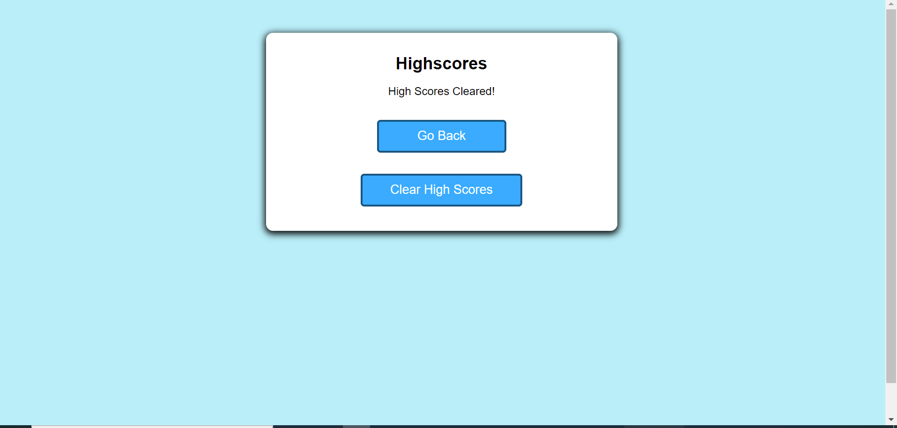

# QuizModuleChallenge

## Table of contents
* [General info](#general-info)
* [Website Link](#website-link)
* [Screenshot](#screenshot)

## General info
This timed quiz project is developed using the javascript,html and css. The user has 100 seconds to answer 10 multiple-choice questions. Every correct answer scores the user 10 pts; an incorrect answer will subtract 10 seconds from the timer.     

## Concepts

* Local storage logic has been used to store the session variables
* Added logic to hide/show the html section based on the user activity 
* clearing the local storage variables 

## Website Link

> Live link [https://maharjn.github.io/QuizModuleChallenge/]

## Screenshot
The following image shows the web application's appearance and functionality:

